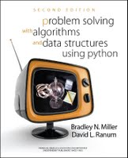

.. Problem Solving with Algorithms and Data Structures documentation master file, created by
   sphinx-quickstart on Thu Oct 27 08:17:45 2011.
   You can adapt this file completely to your liking, but it should at least
   contain the root `toctree` directive.

.. meta::
   :description: Una versión interactiva de Solución de problemas con algoritmos y estructuras de datos usando Python.
   :keywords: python, estructuras de datos, ciencias de la computación

.. toc_version: 2

=========================================================================
Solución de problemas con algoritmos y estructuras de datos usando Python
=========================================================================

Por Brad Miller y David Ranum, Luther College

Traducido por Mauricio Orozco-Alzate, Universidad Nacional de Colombia - Sede Manizales

.. raw:: html

   <ul>
   <li><a href="tareas.html">Tareas</a></li>
   </ul>

.. toctree::
   :numbered:
   :maxdepth: 3

   Introduction/toctree.rst
   AlgorithmAnalysis/toctree.rst
   BasicDS/toctree.rst
   Recursion/toctree.rst
   SortSearch/toctree.rst
   Trees/toctree.rst
   Graphs/toctree.rst

Agradecimientos
:::::::::::::::

Nosotros los autores, Brad Miller y David Ranum, estamos muy agradecidos con Franklin Beedle Publishers por permitirnos que esta versión interactiva esté disponible libremente. Esta versión en línea está dedicada a la memoria de nuestro primer editor, Jim Leisy, que quiso que "cambiáramos el mundo".

El traductor, Mauricio Orozco-Alzate, agradece a la Universidad Nacional de Colombia - Sede Manizales por permitirle emprender el proyecto de traducción como una de sus actividades académicas de su año sabático 2017-2018. La tarea se facilitó en gran medida gracias a la excelente herramienta de traducción gratuita de Google.

Índices y tablas
::::::::::::::::

* :ref:`genindex`
* :ref:`modindex`
* :ref:`search`

.. raw:: html

   
 Problem Solving with Algorithms and Data Structures using Python by Bradley N. Miller, David L. Ranum is licensed under a <a rel="license" href="http://creativecommons.org/licenses/by-nc-sa/4.0/">Creative Commons Attribution-NonCommercial-ShareAlike 4.0 International License</a>.

